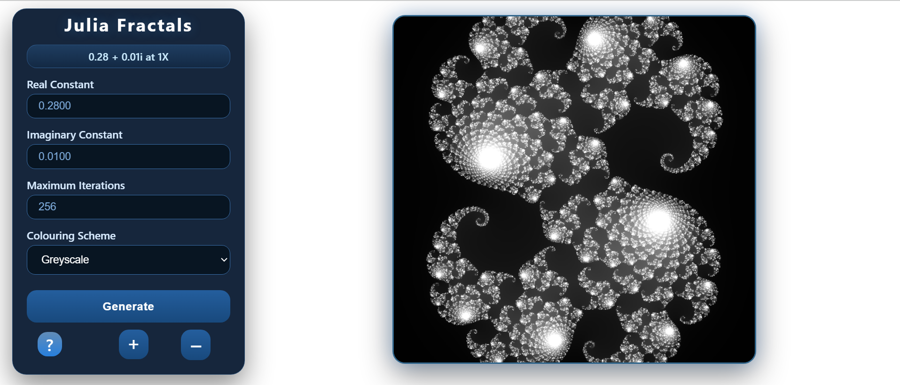

# Fractal_Explorer

This is a Julia fractal explorer created entirely with HTML, CSS, and JavaScript. It does not rely on external libraries like math.js for complex number calculations, which helps to significantly reduce resource usage.It also does not require WebGL or other GPU-based optimisations iinstead it minimises resource consumption in various other ways such as reducing the number of divisions and multiplications within loops and by utilising 32-bits for pixel colouring instead of 8-bits through Uint32Array. This allows users to explore Julia fractals without needing a dedicated GPU or experiencing excessive lag.

## Published Website link :- [Fractal Explorer](https://bhavyabhartiya.github.io/Fractal_Explorer/).

## Theme - Endless

I believe this project should be in the Endless theme as it explores fractals, which are a geometric pattern that remain similar no matter how much you zoom in, and allows the user to experience that interesting phenomenon themselves.
